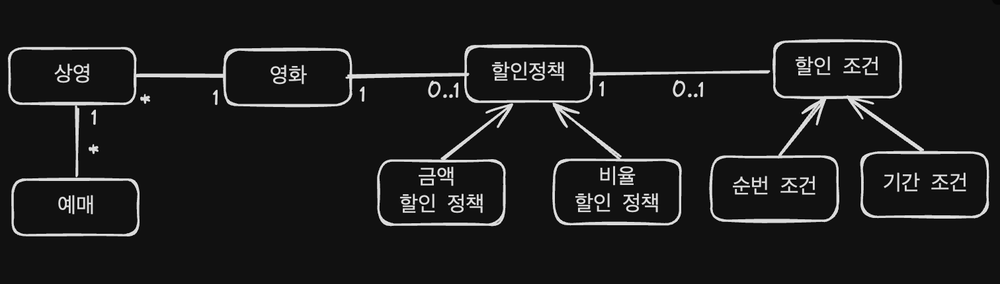
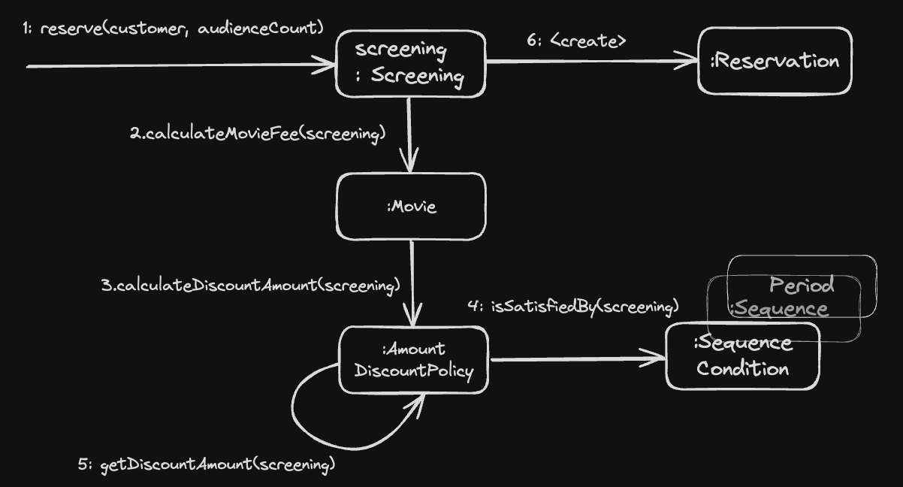

## 책임 주도 설계 (RDD) 

### 영화 예매 시스템 설계
- 요구사항 살펴보기

사용자는 영화 예매 시스템을 이용해 쉽고 빠르게 보고 싶은 영화를 예매할 수 있다.

앞으로의 설명을 위해 영화와 상영이라는 용어를 구분할 필요가 있을 것 같다. 영화는 영화에 대한 기본 정보를 표현한다.
제목, 상연시간, 가격 정보와 같이 영화가 가지고 있는 기본적인 정보를 가리킬때는 영화라는 단어를 사용할 것이다.
상영은 실제로 관객들이 영화를 관람하는 사건을 표현한다.
상영 일자, 시간, 순번 등을 가리키기 위해 '상영' 이라는 용어를 사용할 것이다. 
하나의 영화는 하루 중 다양한 시간대에 걸쳐 한 번 이상 상영될 수 있다.

두 용어의 차이가 중요한 이유는 사용자가 실제로 예매하는 대상은 영화가 아니라 상영이기 때문이다. 사람들은 영화를 예매한다고 표현하지만 실제로는 특정 시간에 상영되는 영화를 관람할 수 있는 권리를 구매하기 위해 돈을 지불한다. 

특정한 조건을 만족하는 예매자는 요금을 할인받을 수 있다. 할인액을 결정하는 2가지 규칙이 존재하는데, 하나는 할인조건(discount condition) 이라고 부르고 다른 하나는  할인 정책(discount policy) 이라고 부른다.

'할인 조건'은 가격의 할인  여부를 결정하며 '순서 조건' 과 '기간 조건'의 두 종류로 나눌 수 있다. 
먼저 '순서 조건' 은 상영 순번을 이용해 할인 여부를 결정하는 규칙이다. 
예를 들어 순서 조건의 순번이 10인 경우 매일 10번째로 상영되는 영화를 예매한 사용자들에게 할인 혜택을 제공한다.

'기간 조건'은 영화 상영 시간을 이용해 할인 여부를 결정한다. 기간 조건은 요일, 시작 시간, 종료 시간의 3부분으로 구성되며 영화 시작 시간이 해당 기간 안에 포함될 경우 요금을 할인한다.  요일이 월요일, 시작 시간이 오전 10시, 종료 시간이 오후1시인 기간 조건을 사용하면 매주 월요일 오전 10 ~ 오후 1시 사이에 상영되는 모든 영화에 대해 할인 혜택을 적용할 수 있다. 


'할인 정책'은 할인 요금을 결정한다. 할인 정책에는 '금액 할인 정책'과 '비율 할인 정책'이 있다. 금액 할인 정책은 예메 요금에서 일정 금액을 할인해주는 방식이며, 비율 할인 정책은 정가에서 일정 비율의 요금을 할인해 주는 방식이다.
어떤 영화의 가격이 9,000 원이고 금액 할인 정책이 800원일 경우 일인당 예메 가격은 9,000 원에서 800원을 뺀 8,200 원이 된다.  이 경우에 금액 할인 정책이 아니라 10%의 비율 할인 정책이 되어 있다면, 9,000 원의 10%인 900원을 할인받을수 있기 때문에 일인당 예매 가격은 8,100 원이 된다. 

영화별로 하나의 할인 정책만 할당할 수 있다. 물론 할인 정책을 지정하지 않는 것도 가능하다. 
이와 달리 할인 조건은 다수의 할인 조건을 함께 지정할 수 있으며, 순서 조건과 기간 조건을 섞는 것도 가능하다. 

아래 표는 영화에 할인 정책과 할인 조건을 설정한 몇 가지 예를 정리한 것이다. 
영화별로 하나의 할인 정책만 적용한 데 비해, 할인 조건은 여러 개를 적용했음을 알 수 있다. 할인 조건의 경우에는 순번 조건과 기간 조건을 함께 혼합할 수 있으며, 할인 정책은 아예 적용하지 않을 수 있다는 사실을 알 수 있다. 
할인 정책은 적용하지 않은 경우에는 영화의 기본 가격이 판매 요금이 된다.

|            **영화**             |        **할인 정책**        |               **할인 조건**               |
| :---------------------------: | :---------------------: | :-----------------------------------: |
|     아바타<br>(가격: 10,000 원)     | 금액 할인 정책<br>(할인액: 800원) |           순번 조건<br>(조조 상영)            |
|                               |                         |           순번 조건<br>(10회 상영)           |
|                               |                         | 기간 조건<br>(월요일 10:00 ~ 12:00 사이 상영 시작) |
|                               |                         | 기간 조건<br>(목요일 18:00 ~ 21:00 사이 상영 시작) |
|    타이타닉<br>(가격: 11,000 원)     | 비율 할인 정책<br>(할인율: 10%)  | 기간 조건<br>(화요일 14:00 ~ 17:00 사이 상영 시작) |
|                               |                         |           순번 조건<br>(2회 상영)            |
|                               |                         | 기간 조건<br>(목요일 10:00 ~ 14:00 사이 상영 시작) |
| 스타워즈:깨어난 포스<br>(가격: 10,000 원) |           없음            |                  없음                   |

할인을 적용하기 위해서는 할인 조건과 할인 정책을 함께 조합해서 사용한다. 먼저 사용자의 예매 정보가 할인 조건 중 하나라도 만족하는지 검사한다.

할인 조건을 만족할 경우 할인 정책을 이용해 할연 요금을 계산한다. 할인 정책은 적용돼 있지만 할인 조건을 만족하지 못하는 경우나 아예 할인 정책이 적용돼 있지 않은 경우에는 요금을 할인하지 않는다. 

사용자가 가격이 10,000 인 아바타를 예매한다고 가정하자. 이 영화에는 800 원의 금액 할인 정책이 적용돼 있다. 따라서 사용자의 예매 정보가 할인 조건을 만족할 경우 1인당 800 원의 요금을 할인해줘야 한다. 
아바타의 할인 조건은 2개의 순번 조건 (조조, 10번째) 와 2개의 기간조건 (월요일 10~12 사이, 목요일 18~21시 사이) 으로 구성돼어 있다. 이 조건을 만족하는 영화를 예매할 경우 원래 가격인 10,000 에서 할인 요금인 800원을 할인받을 수 있기 때문에 사용자는 9,200 원에 영화를 예매할 수 있다. 할인 정책은 1인을 기준으로 책정되기 때문에 예약 인원이 2명이라면 1,600 원의 요금을 할인 받을 수 있다.

사용자가 예매를 완료하면 시스템은 그림과 같은 예매정보를 생성한다. 예매 정보에는 제목, 상영정보, 인원, 정가, 결제금액이 포함된다. 지금까지 영화 예매 시스템의 목적과 개념, 할인과 관련된 규칙을 살펴봤다. 

|  제목   |                     아바타                     |
| :---: | :-----------------------------------------: |
| 상영정보  | 2024년 12월 26일 (목)<br>7회 6:00(오후) ~ 8:00(오후) |
|  인원   |                     2명                      |
|  정가   |                  20,000 원                   |
| 결제 금액 |                  18,400 원                   |

***

### 도메인의 구조를 따르는 프로그램 구조

객체지향 패러다임이 강력한 이유는 요구사항을 분석하는 초기 단계부터 프로그램을 구현하는 마지막 단계까지 객체라는 동일한 추상화 기법을 사용할 수 있기 때문이다. 요구사항과 프로그램을 객체라는 동일한 관점에서 바라볼 수 있기 때문에 도메인을 구성하는 개념들이 프로그램의 객체와 클래스로 매끄럽게 연결될 수 있다. 




### 영화 예매 시스템 돌아보기
사용자가 영화 예매 시스템을 통해 영화를 얘매할 수 있게 하려면 다양한 객체들이 참여하는 협력을 구축해야한다. 그림은 영화 예매라는 기능을 완성하기 위해 협력하는 객체들의 상호작용을 표현한다 



여기서 중요한 것은 다양한 객체들이 영화 예매라는 기능을 구현하기 위해 메시지를 주고받으면서 상호작용한다는 점이다. 이처럼 객체들이 애플리케이션의 기능을 구현하기 위해 수행하는 상호작용을 '**협력**' 이라고 한다. 객체가 협력에 참여하기 위해 수행하는 로직은 '**책임**' 이라고 부른다. 객체들이 협력 안에서 수행하는 책임들이 모여 객체가 수행하는 역할을 구성한다. 


*** 
### 테스트 코드 실행
Starting Spring for DB check
```
./gradlew bootRun  
```

Only for test check
```
./gradlew test  
```